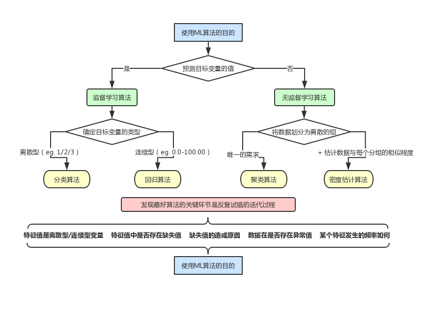

# Chapter 1 机器学习基础

## 算法选择

Step 1 - 考虑使用ML算法的目的

Step 2 - 考虑数据问题：充分了解数据的特性

## 开发ML应用程序

1. 收集数据
2. 准备输入数据：必须确保**数据格式**符合要求
   
   + Python List：标准数据结构，可以融合算法和数据源
   + ML特定数据格式：某些算法要去特征值使用特定的格式

3. 分析输入数据：人工分析数据，主要作用是确保数据集中没有**垃圾数据**
4. 训练算法：从格式化数据中抽取知识或信息，存储为计算机可以处理的格式
5. 测试算法：测试算法工作的效果
6. 使用算法：将算法转换为应用程序，执行实际任务

## NumPy函数库

### 1. 亮点：

矩阵运算：将数据表示为**矩阵形式**，只需要执行矩阵运算，而不需要循环操作

线性代数：简化**不同的数据点**上执行的**相同数学运算**

### 2. 数据类型

**矩阵（matrix）** 和 **数组（array）** 都可以用于处理行列表示的数字元素，但执行 **相同的数学运算** 可能得到 **不同的结果**

### 3. 命令

`random.rand(x,y)` 构造一个x*y的随机数组，eg：random.rand(4,4)

`mat()` 将数组转化为矩阵，eg：randMat = mat(random.rand(4,4))

`.I` 矩阵求逆，eg：invrandMat = randMat.I

`eye(x)` 创建一个x*x的单位矩阵，eg：eye(4)

## 监督学习（supervised learning）

